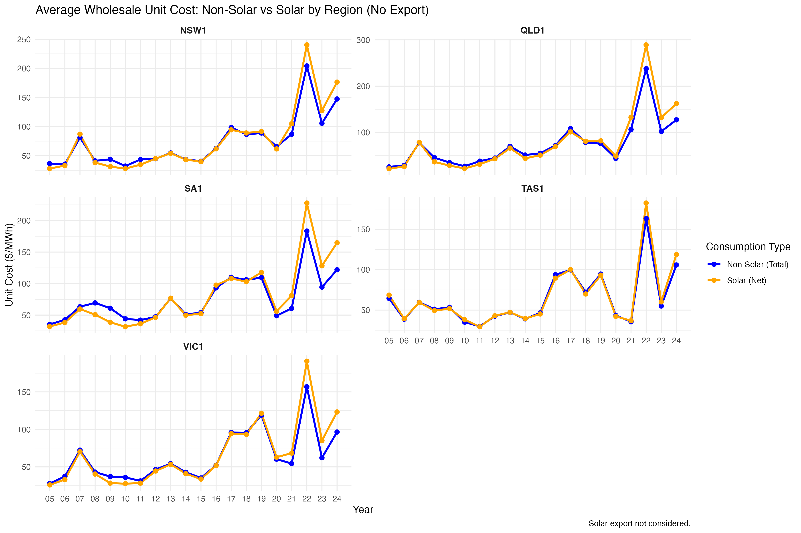
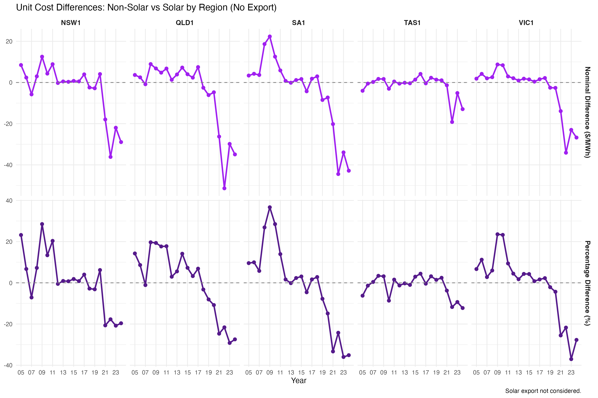
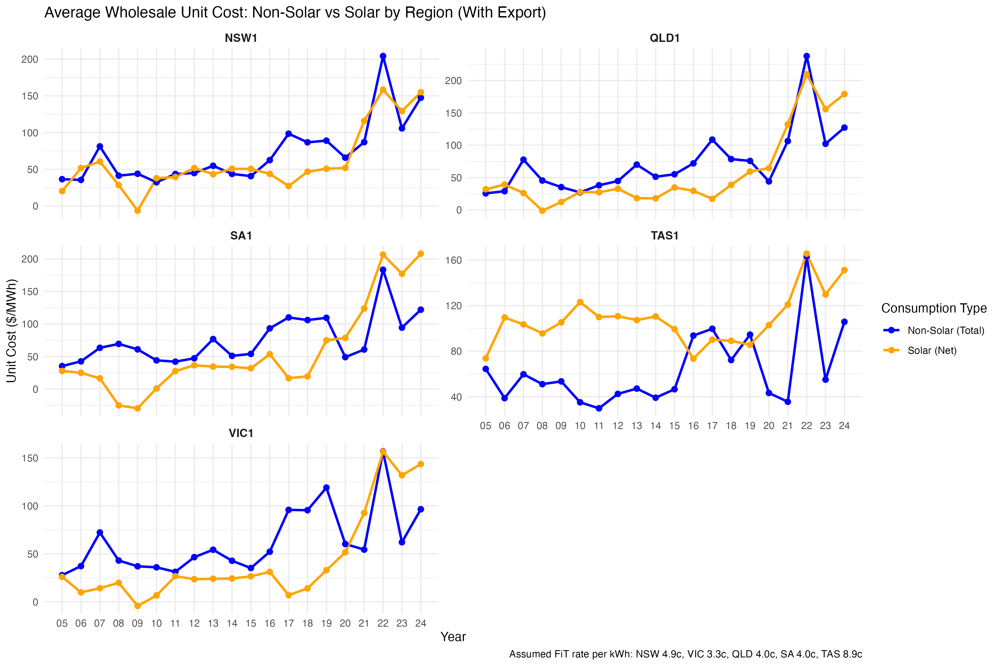
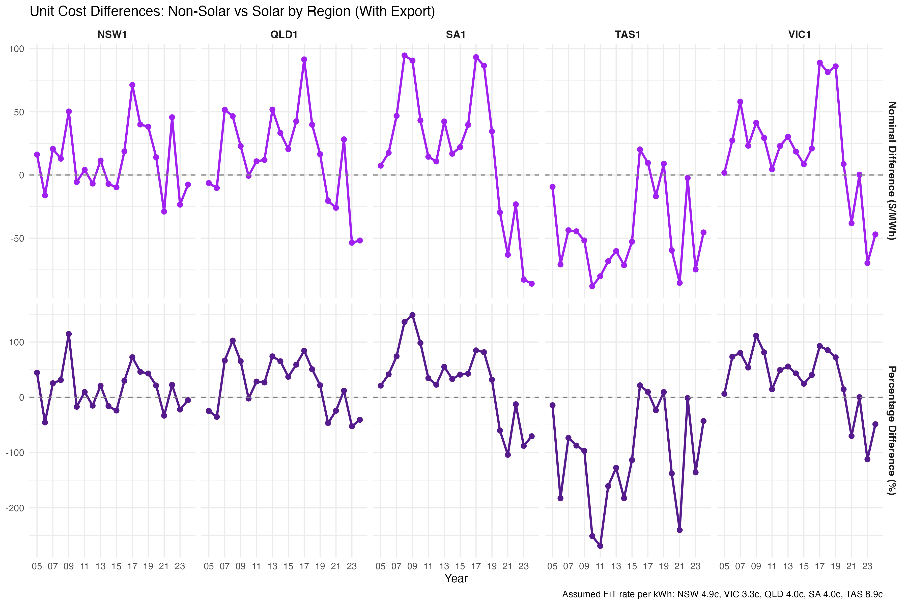

# Wholesale‑Unit‑Cost Gap: Solar vs Non‑Solar Customers  
_A 300‑customer case study using Ausgrid interval data & NEM spot prices (FY‑2024)_

---

## 1 | Why this matters
It is a known issue that rooftop solar customers push wholesale cost and risk onto non‑solar customers.  
This analysis quantifies the **average wholesale unit cost (UC, $/MWh)** of serving two synthetic portfolios:

| Portfolio | Load definition | Size |
|-----------|-----------------|------|
| **Non‑solar cohort** | Total half‑hourly consumption of each Ausgrid customer | 300 |
| **Solar cohort** | **Net** consumption after 6.6 kW PV generation (export curtailed) | 300 |

We examine two cases:

1. **No‑export** – all PV export is spilled (worst‑case for solar).  
2. **With‑export** – export monetised at flat FiTs (NSW 4.9 c, VIC 3.3 c, QLD 4.0 c, SA 4.0 c, TAS 8.9 c per kWh).

> *Hedging:* results below are spot‑only.  A hedge overlay (base swaps + cap strips) is still work in progress.

---

## 2 | Data snapshot
* **Ausgrid Solar Home Electricity** – 300 NSW households, FY 2010-11 to 2012‑13, 30‑min interval data. The average system size (1.68 kW) is up‑scaled to current average system size (**6.6 kW**).  
* **AEMO Regional Reference Price (RRP)** – half‑hourly from 2005 to 2024. Note NEM settlement switched to 5-min settlement from October 2021. Prices are aggregated to 30-min average prices weighted by demand (MW). 
* Consumption & price series are standardised to a dummy year **2020** so weekends/holidays align.

---

## 3 | FY‑2024 headline numbers
| Region | Non‑solar UC | Solar UC *(No‑export)* | Solar UC *(With‑export)* | Difference after FiT |
|--------|-------------:|-----------------------:|-------------------------:|---------------:|
| NSW | 147 | 176 | 155 | +5% |
| VIC | 97 | 123 | 144 | +48% |
| QLD | 127 | 162 | 179 | +41% |
| SA | 122 | 165 | 208 | +70% |
| TAS | 106 | 119 | 151 | +42% |

*Solar households face higher unit wholesale cost across region, but the difference is especially pronounced in South Australia (which has extremely high rooftop solar penetration) and Victoria.*

<div align="center">

  
*Figure 1a – Unit cost series (no export)*  

  
*Figure 1b – Unit cost difference (no export)*  

  
*Figure 2a – FiT‑adjusted series*  

  
*Figure 2b – Unit cost difference (with export)*  

</div>

---

## 4 | What’s driving the gap?
1. PV pushes solar portfolios low and even net negative at low‑price midday periods, which means wholesale purchase is heavily weighted in the higher evening peaks.
2. The gap is the largest in high solar penetration states like SA and VIC; both experience steep evening price ramps from ultra-suppressed midday prices.
3. The peaky nature of solar customer load means retailers use less on baseload swaps and rely on caps or options or other types of hedging products that are more expensive. (TBC with detailed modelling of hedging costs) 

---

## 5 | Implications
* Time‑varying or dynamic FiTs to better match export value to market conditions.
* Growing demand for non‑baseload derivatives – retailers should anticipate higher premiums for peak, cap and shape products as evening‑driven volatility deepens.
* Customer‑mix strategy – a retailer that targets only non‑solar households will likely shoulder—and pass through—smaller wholesale and hedging costs.


---

## 6 | Caveats & next steps
* **NSW‑centric load** – Ausgrid customers may not represent other states’ usage or irradiance.  
* PV vintage scaling – dated sample assumes consumption unchanged; original 1.68 kW solar systems scaled up by factor of 3.9 to reflect current average system size (6.6 kW).
* **Weather variation** – no year‑on‑year weather normalisation.  
* Next step: Complete modelling wholesale costs with hedging practices (baseload swaps and caps)

---


## Repo map
```
.
├── 01-ausgrid-solar-customers
├── 02-nem-wholesale-price
├── 11-Solar_load_profile.qmd
├── 12-Wholesale_prices.qmd
├── 13-model_wholesale_cost.qmd
├── 20-figures/
└── README.md
```

