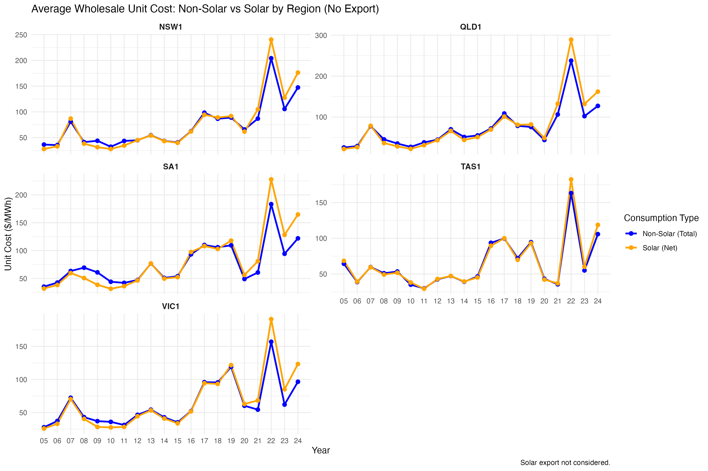
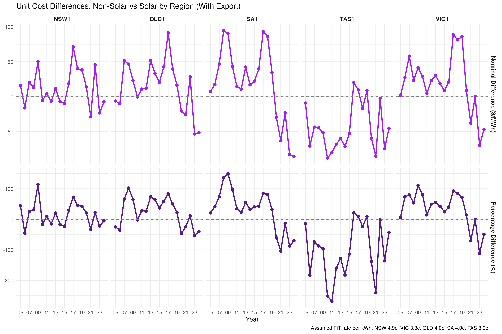

# Wholesale‑Unit‑Cost Gap: Solar vs Non‑Solar Customers  
_A 300‑customer case study using Ausgrid interval data & NEM spot prices (FY‑2024)_

## 1 | Background & Objectives
Retail electricity retailers increasingly argue that rooftop-solar households shift wholesale risk onto non-solar customers.  
This project quantifies that claim by comparing the **average wholesale unit cost ($/MWh)** of serving two synthetic portfolios:

| Portfolio            | Load definition                                                  | Size  |
|----------------------|------------------------------------------------------------------|-------|
| **Non-solar cohort** | Total half‑hourly consumption profile of each Ausgrid customer    | 300 HH |
| **Solar cohort**     | **Net** consumption after 6.6 kW PV generation (export curtailed) | 300 HH |

The following analysis is **spot-only** (no hedging) and reports both:

1. *No-export* case (all PV export spilled)  
2. *With-export* case (FiT applied: NSW 4.9c, VIC 3.3c, QLD 4.0c, SA 4.0c, TAS 8.9c per kWh)

Note: Hedging modelling is work in progress.

## 2 | Data Overview

- **Ausgrid Solar Home Electricity**: 300 NSW customers, FY2011‑2013, 30-min kWh for CL (consumption), GG (PV).  
  - Scaled vintage 1.68 kW systems to **6.6 kW** (2024 typical).
- **AEMO Price & Demand**: Half-hourly RRP 2005‑present, in Australia/Brisbane TZ.
- **Derived**: Standardised 30-min profiles to dummy year **2020** for merge.

<details>
<summary>Table schema</summary>

| Table               | Rows  | Key columns               | Notes                                      |
|---------------------|-------|---------------------------|--------------------------------------------|
| `dt_ausgrid_long`   | 47M   | `Customer, Timestamp`     | CL, GG, GC → Net_Consmp                   |
| `nem_30min`         | 4.1M  | `REGION, Interval_Start`  | Demand-weighted RRP                        |
</details>

## 3 | Executive Summary (FY‑2024)

| NEM Region | Non-solar UC | Solar UC (No-export) | Solar UC (With-export) | Gap with export |
|------------|-------------:|---------------------:|-----------------------:|----------------:|
| NSW        | 147     | 176                  | 155                    | + 8         |
| VIC        | 97          | 123                  | 144                    | + 47            |
| QLD        | 127         | 162                  | 179                    | + 52            |
| SA         | 122         | 165                  | 208                | + 86        |
| TAS        | 106         | 119                  | 151                    | + 45            |

*Solar portfolios pay higher wholesale costs in every region once exports are valued.*

<div align="center">

  
_Figure 1a. Unit cost series (no export)_  

  
_Figure 1b. Unit cost difference (no export)_  

  
_Figure 2a. FiT‑adjusted series_

  
_Figure 2b. Unit cost difference (with export)_  

</div>

## 4 | Insight Deep‑Dive

| # | Finding                                                                    | Evidence            |
|---|----------------------------------------------------------------------------|---------------------|
| 1 | Solar portfolios pay higher average UC even before export is valued.       | Fig 1; load‑distribution charts |
| 2 | FiTs worsen the gap except in NSW where evening prices help offset export.  | Fig 2               |
| 3 | SA & VIC penalties highest due to midday net-negative load needing peak buy. | Fig 3               |

## 5 | Recommendations
1. **Time‑value rebates** instead of flat FiTs to reduce cross-subsidy.  
2. **Portfolio hedging** — WIP indicates base swaps trim up to 25 % of gap (`/notebooks/hedge_WIP.qmd`).  
3. **State‑specific samples** (Energex, SAPN) for locational PV shapes.

## 6 | Data & Limitations
- **NSW sample only** — other states differ in load & irradiance.  
- **Vintage PV** scaled (1.68 → 6.6 kW); shape preserved.  
- **No weather normalisation** across years.  
- **Spot-exposed retailer**; hedging in dev.

## 7 | Reproduce the analysis
```bash
# 1. Clone & restore
git clone https://github.com/<user>/solar_vs_nonsolar_ucost.git
cd solar_vs_nonsolar_ucost
renv::restore()

# 2. Render notebooks
quarto render 11-Solar_load_profile.qmd
quarto render 12-Wholesale_prices.qmd
quarto render 13-model_wholesale_cost.qmd
```

## 8 | Repo Map
```
.
├── 01-ausgrid-solar-customers
├── 02-nem-wholesale-price
├── 11-Solar_load_profile.qmd
├── 12-Wholesale_prices.qmd
├── 13-model_wholesale_cost.qmd
├── figures/
└── README.md
```

